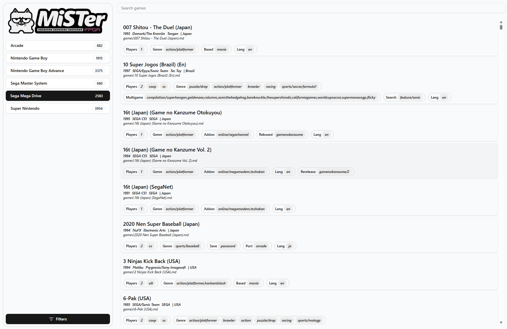
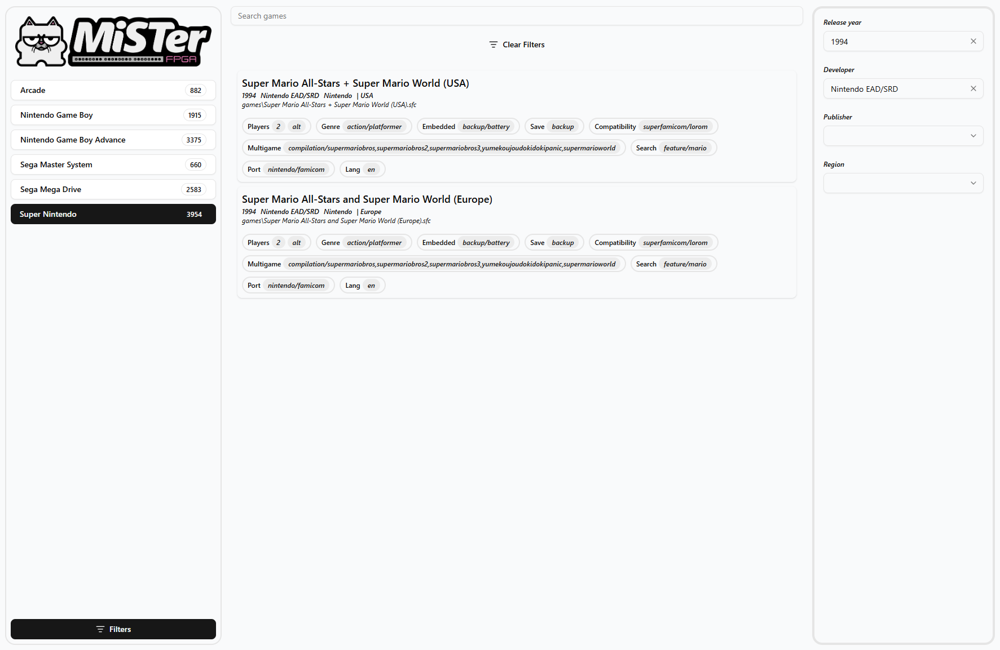

# MiSTer FPGA - Smart Scanner

## Overview
**MiSTeR FPGA - Smart Launcher** is an application for MiSTer FPGA that lets you easy browse your ROM set, filter it, and launch games from any device (PC/Smart Phone/Tablet) through a web browser. 
It creates a very lightweight web server under the hood.

## Before Installation
The application uses a database containing all the information about the ROM set you are using on MiSTer.
To generate the database, you need to use the appication **MiSTeR FPGA - Smart Scanner**.
You can find all the informations [here](https://github.com/gerrykeys/MiSTer-FPGA_Smart-Scanner).

## Installation
Once you have generated the database, follow the steps below:

- Copy the application folder in `/media/fat/Scripts`
- Copy the `database` folder inside the installation folder `/media/fat/Scripts/MiSTer-Smart-Launcher`
- On the MiSTer, go to the Scripts menu and enter the installation folder.
- Select the file `run.sh`

Once this is done, you can access it from any browser at the following address:

`http://<YOUR-MISTER-IP>:8282`

Remember: if you reset the MiSTer, you will need to launch "run.sh" again.
In the future, there will be the option to install/uninstall the script as a service,
so that it starts automatically every time the MiSTer powers on or is reset.

## Suported Systems
The followings systems are supported (More systems will be available in future)

| Systems                        | Core (RBF)            | Supported formats      |
| ------------------------------ |:---------------------:|:----------------------:|
| Arcade                         | _Arcade/cores         | .mra                   |
| Neo Geo                        | _Console/NeoGeo       | .neo                   |
| Nintendo / Famicom             | _Console/NES          | .nes                   |
| Nintendo 64                    | _Console/N64          | .z64, .n64             |
| Nintendo Game Boy              | _Console/Gameboy      | .gb                    |
| Nintendo Game Boy Advance      | _Console/GBA          | .gba                   |
| Nintendo Game Boy Color        | _Console/Gameboy      | .gbc                   |
| Sega Master System             | _Console/SMS          | .sms                   |
| Sega Mega Drive                | _Console/MegaDrive    | .bin, .gen, .md        |
| Sega Genesis                   | _Console/Genesis      | .bin, .gen, .md        |
| Super Nintendo / Super Famicom | _Console/SNES         | .sfc                   |
| PC Engine / Turbo Grafx16      | _Console/TurboGrafx16 | .bin, .pce             |

## Roms in .Zip archive
ROMs with compatible extensions and compressed in .zip format are supported. 
Generally, MiSTer cores do not support the .zip format.
However, when MiSTer is used through the native UI interface, it can browse archives as if they were folders and allows selecting the ROM to launch.
When this happens, MiSTer handles unpacking the ROM and provides it as input to the relevant core.
**MiSTer FPGA – Smart Launcher** application therefore handles the unpacking of zip files in the same way. 

